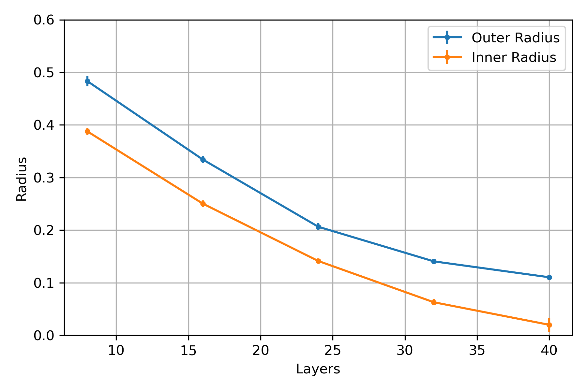
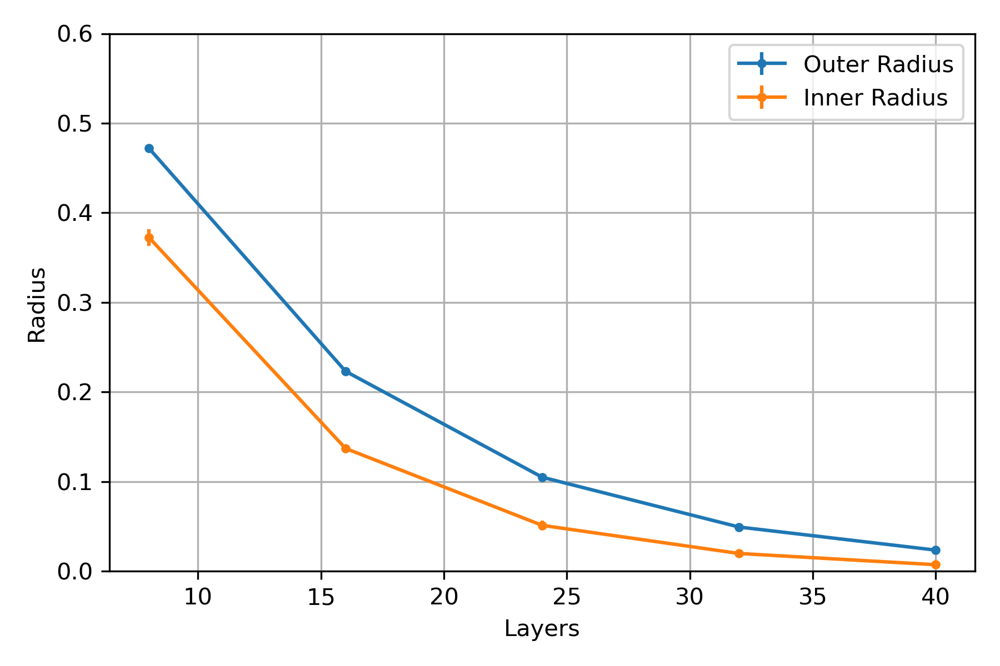
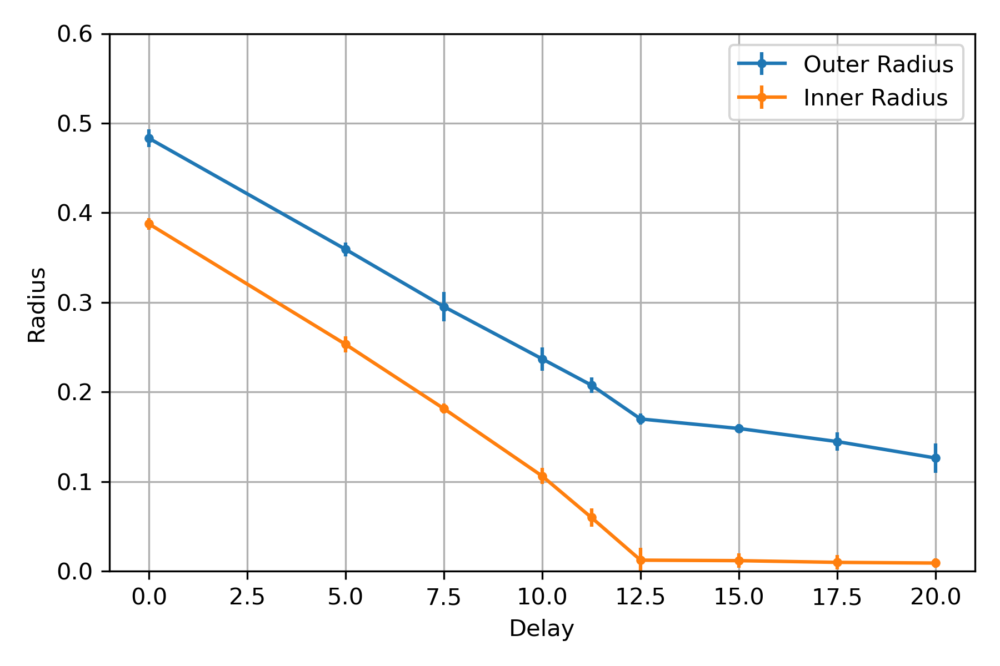

# Collapsing Inner and Outer Radius in NISQ Spectra

The retrieved spectra of NISQ variational circuits are characteristic: They are annulus shaped with a clearly defined inner and outer radius. From the previous results, we know the diluted unitary model is able to capture this general shape. 

What happens to the NISQ spectra when we increase the amount of noise? There are at least two ways we can increase the amount of noise when impementing NISQ parametric: Increasing the number of variational layers (simply adding more gates), or ideling the computer after implementing the circuit. These two ways can be attempted to be formulated as Diluted Unitary analogs. Here is the Repeated Diluted Unitary model:

$\mathbb{T} _{Rep} = \prod _{i=1}^L (p\mathbb{U} _i + (1-p)\mathbb{K} _i),$

where $\mathbb{U}_i$ is some slice of the unitary circuit (either a single gate, a layer, or buch of layers), and $\mathbb{K}_i$ is a random Kraus map of some rank. $p$ controls the amount of noise, and $L$ is the number of slices.

Here is the Delay Diluted Unitary model:

$\mathbb{T} _{Delay} = [\prod _{i=1}^L (qI + (1-q)\mathbb{K} _i)] (p\mathbb{U} + (1-p)\mathbb{K}).$

Here, the dissipation is modelled by a repeated diluted identity channel. $q$ controls the amount of noise from the idling, and $p$ controls the amount of noise from the circuit. Alternatively, the dissipation can be modelled by a single diluted identity channel, but then a choice needs to be made on how $q$ and the rank of $\mathbb{K}_i$ should relate to the idling time.

## Observations
Some few observations

### Repeated Diluted Unitary

By expanding $\mathbb{T}_{Rep}$, we get many cross terms between unitaries and kraus maps:

$\mathbb{T}_{Rep} = p^L\mathbb{U} + \sum \cdots,$
here the sum contains all terms with at least one Kraus map. Since the Kraus maps are random, the cross terms will be random. I.e., for a random Kraus operator $K_i$, $U K_i$ follows the same distribution, however $U$ is sampled (is this true? my intuition says yes). The repeated diluted unitary may be reformulated into a standard diluted unitary:

$
\mathbb{T}_{Rep} = p^L\mathbb{U} + (1-p^L)\mathbb{K} = p'\mathbb{U} + (1-p')\mathbb{K},
$
where $\mathbb{K}$ is the effective map stemming from the cross terms (of course, the Kraus operators of this map will we correlated in a special way, it is maybe naive to think that it is the same as just sampling a random highrank map. However, I suspect it does not matter for the following discussion). We can freely control $p'$ by choosing $p$ and $L$. However, the rank of $\mathbb{K}$ is not easily controllable. For high L, $\mathbb{K}$ will be high rank, even if the rank of each individual Kraus map is low, because they are many. Therefore, the repeated diluted unitary model is more constrained than the diluted unitary model.

If we dilute the circuit at the gate level, we get the problem that the resulting dynamics are effectivly high rank. We therefore attemp to dilute at the a higher level: Not even at the layer level, we dilute bunches of 8 layers.

Further, the structure of $\mathbb{K}$ is interesting. Assume we can ignore the $\mathbb{U}_i$, and that all kraus operators are just random kraus operators. Their weights are on the form $p^x (1-p)^{L-x}$. This is a very particular distribution, which will likely be the defining feature of the repeated diluted unitary model beyond the normal diluted unitary model.

### Delay Diluted Unitary

As with the repreated diluted unitary, also the delay diluted unitary gets enforced a specific dynamics by the choice of number of slices $L$. This choise is completely arbitrary conceptually (the dynamics should not change depending on if you choose to think about an idling gate as 10 seperate events, or 100), yet it influences the dynamics, which is annoying.

## Results

NISQ Repeated Circuit

Synthetic Repeated Diluted Unitary. The rank and p of the diluted model is adjusted so that the NISQ and syntheic spectra match for $8$ layers. Then, the synthetic model is repeated, and the hope is that the behaviour will generalize (at least quanlitatively) that of the NISQ circuit.

Two differences: Both Inner and Outer radius decay faster than expected. The Outer radius also decay too fast relative to the inner radius. This can be seen as a thinning of the annulus, which is caused by a high effective. If dilution was introduced at the layer level, or even worse gate level, this effect would be more pronounced. 

NISQ Delay Circuit

Synthetic Delay Diluted Unitary. The rank and $p$ of the first is kept as in the previous example (best diluted unitary fit to the 8 layer circuit). Then, the rank and $q$ of the diluted identity is adjusted so that the NISQ and syntheic spectra match for $16$ layers. Then, this model is repeated and we hope the rest of the dynamics will be captured.

Indeed, we get a slow, exponentially decaying dehaviour of the inner and outer radius, as with the repeated diluted unitary. This is not surprising, becase when we expand $[\prod_{i=1}^L (qI + (1-q)\mathbb{K}_i)]$, we do get an exponential term $(1-q^L)$ in front of the Kraus map. Of course, the inner and outer radii decay exponentially, not in the concave way as in the experiment. We could swap the model for the idling channel to a single diluted identity channel, but how to we parameterize the rank and $q$? We know we can find a set of $q$ 's and ranks by doing Diluted Unitary Fitting on the real data, but this is not a model with predictive power. What would then be a good way to procede here?

